# ArchiMate summary

References:

* [ArchiMate PlantUML macros](https://github.com/plantuml-stdlib/Archimate-PlantUML/blob/master/Archimate.puml)

## ArchiMate terminology

ArchiMate terminology focuses on these categories of words, that range from high-level to low-level:

* Motivation words
* Strategy words
* Business words
* Application words
* Technology words
* Physical words
* Implementation words

### Motivation words

* **Stakeholder**: the role of an individual, team, or organization (or classes thereof) that represents their interests in the effects of the architecture.

* **Driver**: an external or internal condition that motivates an organization to define its goals and implement the changes necessary to achieve them.

* **Assessment**: the result of an analysis of the state of affairs of the enterprise with respect to some driver.

* **Goal**: a high-level statement of intent, direction, or desired end state for an organization and its stakeholders.

* **Outcome**: an end result.

* **Principle**: a statement of intent defining a general property that applies to any system in a certain context in the architecture.

* **Requirement**: a statement of need defining a property that applies to a specific system as described by the architecture.

* **Constraint**: a factor that limits the realization of goals.

* **Meaning**: the knowledge or expertise present in, or the interpretation given to, a concept in a particular context.

* **Value**: the relative worth, utility, or importance of a concept.

### Strategy words

* **Resource**: an asset owned or controlled by an individual or organization.

* **Capability**: an ability that an active structure element, such as an organization, person, or system, possesses.

* **Value Stream**: a sequence of activities that create an overall result for a customer, stakeholder, or end user.

* **Course of Action**: an approach or plan for configuring some capabilities and resources of
the enterprise, undertaken to achieve a goal.

### Business words

* **Business Actor**: a business entity that is capable of performing behavior.

* **Business Role**: the responsibility for performing specific behavior, to which an actor can be assigned, or the part an actor plays in a particular action or event.

* **Business Collaboration**:  an aggregate of two or more business internal active structure elements that work together to perform collective behavior.

* **Business Interface**: a point of access where a business service is made available to the
environment.

* **Business Process**: a sequence of business behaviors that achieves a specific result such as a defined set of products or business services.

* **Business Function**:  a collection of business behavior based on a chosen set of criteria (typically required business resources and/or competencies), closely aligned to an organization, but not necessarily explicitly governed by the organization.
  
* **Business Interaction**: a unit of collective business behavior performed by (a collaboration of) two or more business actors, business roles, or business collaborations.

* **Business Event**: an organizational state change.

* **Business Service**: explicitly defined behavior that a business role, business actor, or business collaboration exposes to its environment.

* **Business Object**: a concept used within a particular business domain.

* **Contract**: a formal or informal specification of an agreement between a provider and a consumer that specifies the rights and obligations associated with a product and establishes functional and non-functional parameters for interaction.

* **Representation**: a perceptible form of the information carried by a business object.

* **Product**: a coherent collection of services and/or passive structure elements, accompanied by a contract/set of agreements, which is offered as a whole to (internal or external) customers.

### Application words

* **Application Component**: an encapsulation of application functionality aligned to implementation structure, which is modular and replaceable.

* **Application Collaboration**: an aggregate of two or more application internal active structure elements that work together to perform collective application behavior.

* **Application Interface**: a point of access where application services are made available to a user, another application component, or a node.

* **Application Function**: automated behavior that can be performed by an application component.

* **Application Interaction**: a unit of collective application behavior performed by (a collaboration of) two or more application components.

* **Application Process**: a sequence of application behaviors that achieves a specific result.

* **Application Event**: an application state change.

* **Application Service**: an explicitly defined exposed application behavior.

* **Data Object**: data structured for automated processing.

### Technology words

* **Node**: a computational or physical resource that hosts, manipulates, or interacts with other computational or physical resources.

* **Device**: a physical IT resource upon which system software and artifacts may be stored or deployed for execution.

* **System Software**: software that provides or contributes to an environment for storing, executing, and using software or data deployed within it.

* **Technology Collaboration**: an aggregate of two or more technology internal active structure elements that work together to perform collective technology behavior.

* **Technology interface**: a point of access where technology services offered by a node can be accessed.

* **Path**: a link between two or more nodes, through which these nodes can exchange data, energy, or material.

* **Communication Network**: a set of structures that connects nodes for transmission, routing, and reception of data.

* **Technology function**: a collection of technology behavior that can be performed by a node.

* **Technology process**: a sequence of technology behaviors that achieves a specific result.

* **Technology interaction**: a unit of collective technology behavior performed by (a collaboration of) two or more nodes.

* **Technology event**: a technology state change.

* **Technology service**: an explicitly defined exposed technology behavior.

* **Artifact**: a piece of data that is used or produced in a software development process, or by deployment and operation of an IT system.

### Physical words

* **Equipment**: one or more physical machines, tools, or instruments that can create, use, store, move, or transform materials.
  
* **Facility**: a physical structure or environment.
  
* **Distribution Network**: a physical network used to transport materials or energy.

* **Material**: tangible physical matter or energy.

### Implementation words

* **Work Package**: a series of actions identified and designed to achieve specific results within specified time and resource constraints.

* **Deliverable**: a precisely-defined result of a work package.

* **Implementation Event**: a state change related to implementation or migration.

* **Plateau**: a relatively stable state of the architecture that exists during a limited period of time.

* **Gap**: a statement of difference between two plateaus.

## ArchiMate diagramming

ArchiMate diagramming focuses on these categories of elements, that range from high-level to low-level:

* Motivation elements
* Strategy elements
* Business elements
* Application elements
* Technology elements
* Physical elements
* Implementation elements

### Motivation elements

<table>
  <thead>
    <tr>
      <th>Element</th>
      <th>Definition</th>
      <th>Notation</th>
      <th>Example</th>
    </tr>
  </thead>
  <tbody>
    <tr>
      <td>Stakeholder</td>
      <td>the role of an individual, team, or organization (or classes thereof) that represents their interests in the effects of the architecture.</td>
      <td>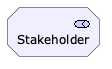</td>
      <td>CEO at ACME</td>
    </tr>
    <tr>
      <td>Driver</td>
      <td>an external or internal condition that motivates an organization to define its goals and implement the changes necessary to achieve them.</td>
      <td>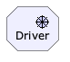</td>
      <td>Customer satisfaction</td>
    </tr>
    <tr>
      <td>Assessment</td>
      <td>the result of an analysis of the state of affairs of the enterprise with respect to some driver.</td>
      <td>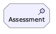</td>
      <td>Net Promoter Score is 25</td>
    </tr>
    <tr>
      <td>Goal</td>
      <td>a high-level statement of intent, direction, or desired end state for an organization and its stakeholders.</td>
      <td>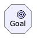</td>
      <td>Increase customer satisfaction as measured by Net Promoter Score.</td>
    </tr>
    <tr>
      <td>Outcome</td>
      <td>an end result.</td>
      <td>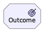</td>
      <td>Net Promoter Score is 30+ by end of quarter.</td>
    </tr>
    <tr>
      <td>Principle</td>
      <td>a statement of intent defining a general property that applies to any system in a certain context in the architecture.</td>
      <td>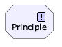</td>
      <td>We speak directly with customers to learn from them.</td>
    </tr>
    <tr>
      <td>Requirement</td>
      <td>a statement of need defining a property that applies to a specific system as described by the architecture.</td>
      <td>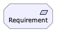</td>
      <td>Hire 5 customer service representatives</td>
    </tr>
    <tr>
      <td>Constraint</td>
      <td>a factor that limits the realization of goals.</td>
      <td>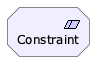</td>
      <td>Hiring customer service representatives and training them takes time and costs money.</td>
    </tr>
    <tr>
      <td>Meaning</td>
      <td>the knowledge or expertise present in, or the interpretation given to, a concept in a particular context.</td>
      <td>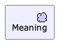</td>
      <td>Successful customer onboarding</td>
    </tr>
    <tr>
      <td>Value</td>
      <td>the relative worth, utility, or importance of a concept.</td>
      <td>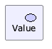</td>
      <td>A customer generates what they want twice as fast</td>
    </tr>
  </tbody>
</table>

### Strategy elements

<table>
  <thead>
    <tr>
      <th>Element</th>
      <th>Description</th>
      <th>Notation</th>
    </tr>
  </thead>
  <tbody>
    <tr>
      <td>Resource</td>
      <td>an asset owned or controlled by an individual or organization.</td>
      <td>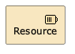</td>
    </tr>
    <tr>
      <td>Capability</td>
      <td>an ability that an active structure element, such as an organization, person, or system, possesses.</td>
      <td>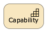</td>
    </tr>
    <tr>
      <td>Value stream</td>
      <td>a sequence of activities that &nbsp;create an overall result for a customer, stakeholder, or end user.</td>
      <td>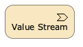</td>
    </tr>
    <tr>
      <td>Course of action</td>
      <td>an approach or plan for configuring some capabilities and resources of the enterprise, undertaken to achieve a goal.</td>
      <td>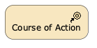</td>
    </tr>
  </tbody>
</table>

### Business elements

<table>
  <thead>
    <tr>
      <td>Element</td>
      <td>Description</td>
      <td>Notation</td>
    </tr>
  </thead>
  <tbody>
    <tr>
      <td>Business Actor</td>
      <td>a business entity that is capable of performing behavior.</td>
      <td>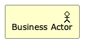</td>
    </tr>
    <tr>
      <td>Business Role</td>
      <td>the responsibility for performing specific behavior, to which an actor can be assigned, or the part an actor plays in a particular action or event.</td>
      <td>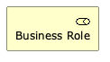</td>
    </tr>
    <tr>
      <td>Business Collaboration</td>
      <td>an aggregate of two or more business internal active structure elements that work together to perform collective behavior.</td>
      <td>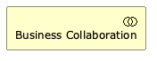</td>
    </tr>
    <tr>
      <td>Business Interface</td>
      <td>a point of access where a business service is made available to the environment.</td>
      <td>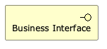</td>
    </tr>
    <tr>
      <td>Business Process</td>
      <td>a sequence of business behaviors that achieves a specific result such as a defined set of products or business services.</td>
      <td>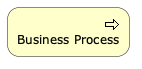</td>
    </tr>
    <tr>
      <td>Business Function</td>
      <td>a collection of business behavior based on a chosen set of criteria (typically required business resources and/or competencies), closely aligned to an organization, but not necessarily explicitly governed by the organization.</td>
      <td>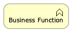</td>
    </tr>
    <tr>
      <td>Business Interaction</td>
      <td>a unit of collective business behavior performed by (a collaboration of) two or more business actors, business roles, or business collaborations.</td>
      <td>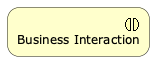</td>
    </tr>
    <tr>
      <td>Business Event</td>
      <td>an organizational state change.</td>
      <td>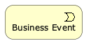</td>
    </tr>
    <tr>
      <td>Business Service</td>
      <td>explicitly defined behavior that a business role, business actor, or business collaboration exposes to its environment.</td>
      <td>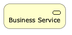</td>
    </tr>
    <tr>
      <td>Business Object</td>
      <td>a concept used within a particular business domain.</td>
      <td>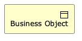</td>
    </tr>
    <tr>
      <td>Contract</td>
      <td>a formal or informal specification of an agreement between a provider and a consumer that specifies the rights and obligations associated with a product and establishes functional and non-functional parameters for interaction.</td>
      <td>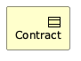</td>
    </tr>
    <tr>
      <td>Representation</td>
      <td>a perceptible form of the information carried by a business object.</td>
      <td>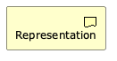</td>
    </tr>
    <tr>
      <td>Product</td>
      <td>a coherent collection of services and/or passive structure elements, accompanied by a contract/set of agreements, which is offered as a whole to (internal or external) customers.</td>
      <td>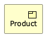</td>
    </tr>
  </tbody>
</table>

### Application elements

<table>
  <thead>
    <tr>
      <td>Element</td>
      <td>Definition</td>
      <td>Notation</td>
    </tr>
  </thead>
  <tbody>
    <tr>
      <td>Application Component</td>
      <td>an encapsulation of application functionality aligned to implementation structure, which is modular and replaceable.</td>
      <td>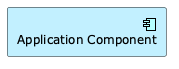</td>
    </tr>
    <tr>
      <td>Application Collaboration</td>
      <td>an aggregate of two or more application internal active structure elements that work together to perform collective application behavior.</td>
      <td>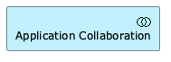</td>
    </tr>
    <tr>
      <td>Application Interface</td>
      <td>a point of access where application services are made available to a user, another application component, or a node.</td>
      <td>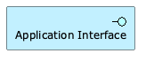</td>
    </tr>
    <tr>
      <td>Application Function</td>
      <td>automated behavior that can be performed by an application component.</td>
      <td>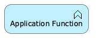</td>
    </tr>
    <tr>
      <td>Application Interaction</td>
      <td>a unit of collective application behavior performed by (a collaboration of) two or more application components.</td>
      <td>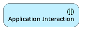</td>
    </tr>
    <tr>
      <td>Application Process</td>
      <td>a sequence of application behaviors that achieves a specific result.</td>
      <td>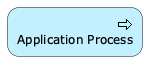</td>
    </tr>
    <tr>
      <td>Application Event</td>
      <td>an application state change.</td>
      <td>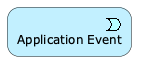</td>
    </tr>
    <tr>
      <td>Application Service</td>
      <td>an explicitly defined exposed application behavior.</td>
      <td>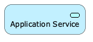</td>
    </tr>
    <tr>
      <td>Data Object</td>
      <td>data structured for automated processing.</td>
      <td>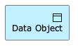</td>
    </tr>
  </tbody>
</table>

### Technology elements

<table>
  <thead>
    <tr>
      <td>Element</td>
      <td>Definition</td>
      <td>Notation</td>
    </tr>
  </thead>
  <tbody>
    <tr>
      <td>Node</td>
      <td>a computational or physical resource that hosts, manipulates, or interacts with other computational or physical resources.</td>
      <td>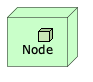</td>
    </tr>
    <tr>
      <td>Device</td>
      <td>a physical IT resource upon which system software and artifacts may be stored or deployed for execution.</td>
      <td>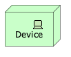</td>
    </tr>
    <tr>
      <td>System Software</td>
      <td>software that provides or contributes to an environment for storing, executing, and using software or data deployed within it.</td>
      <td>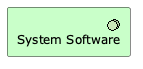</td>
    </tr>
    <tr>
      <td>Technology collaboration</td>
      <td>an aggregate of two or more technology internal active structure elements that work together to perform collective technology behavior.</td>
      <td>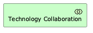</td>
    </tr>
    <tr>
      <td>Technology interface</td>
      <td>a point of access where technology services offered by a node can be accessed.</td>
      <td></td>
    </tr>
    <tr>
      <td>Technology path</td>
      <td>a link between two or more nodes, through which these nodes can exchange data, energy, or material.</td>
      <td>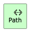</td>
    </tr>
    <tr>
      <td>Technology communication network</td>
      <td>a set of structures that connects nodes for transmission, routing, and reception of data.</td>
      <td>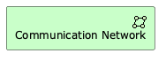</td>
    </tr>
    <tr>
      <td>Technology function</td>
      <td>a collection of technology behavior that can be performed by a node.</td>
      <td>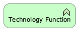</td>
    </tr>
    <tr>
      <td>Technology process</td>
      <td>a sequence of technology behaviors that achieves a specific result.</td>
      <td>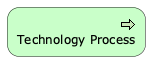</td>
    </tr>
    <tr>
      <td>Technology interaction</td>
      <td>a unit of collective technology behavior performed by (a collaboration of) two or more nodes.</td>
      <td></td>
    </tr>
    <tr>
      <td>Technology event</td>
      <td>a technology state change.</td>
      <td>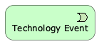</td>
    </tr>
    <tr>
      <td>Technology service</td>
      <td>an explicitly defined exposed technology behavior.</td>
      <td></td>
    </tr>
    <tr>
      <td>Artifact</td>
      <td>a piece of data that is used or produced in a software development process, or by deployment and operation of an IT system.</td>
      <td>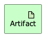</td>
    </tr>
  </tbody>
</table>

### Physical elements

<table>
  <thead>
    <tr>
      <td>Element</td>
      <td>Definition</td>
      <td>Notation</td>
    </tr>
  </thead>
  <tbody>
    <tr>
      <td>Equipment</td>
      <td>one or more physical machines, tools, or instruments that can create, use, store, move, or transform materials.</td>
      <td></td>
    </tr>
    <tr>
      <td>Facility</td>
      <td>a physical structure or environment.</td>
      <td>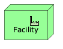</td>
    </tr>
    <tr>
      <td>Distribution Network</td>
      <td>a physical network used to transport materials or energy.</td>
      <td>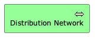</td>
    </tr>
    <tr>
      <td>Material</td>
      <td>tangible physical matter or energy.</td>
      <td>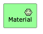</td>
    </tr>
  </tbody>
</table>

## Implementation elements

<table>
  <thead>
    <tr>
      <td>Element</td>
      <td>Definition</td>
      <td>Notation</td>
    </tr>
  </thead>
  <tbody>
    <tr>
        <td>Work Package</td>
        <td>a series of actions identified and designed to achieve specific results within specified time and resource constraints.</td>
        <td>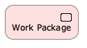</td>
    </tr>
    <tr>
        <td>Deliverable</td>
        <td>a precisely-defined result of a work package.</td>
        <td></td>
    </tr>
    <tr>
        <td>Implementation Event</td>
        <td>a state change related to implementation or migration.</td>
        <td></td>
    </tr>
    <tr>
        <td>Plateau</td>
        <td>a relatively stable state of the architecture that exists during a limited period of time.</td>
        <td></td>
    </tr>
    <tr>
      <td>Gap</td>
        <td>a statement of difference between two implementation plateaus.</td>
        <td></td>
    </tr>
  </tbody>
</table>
